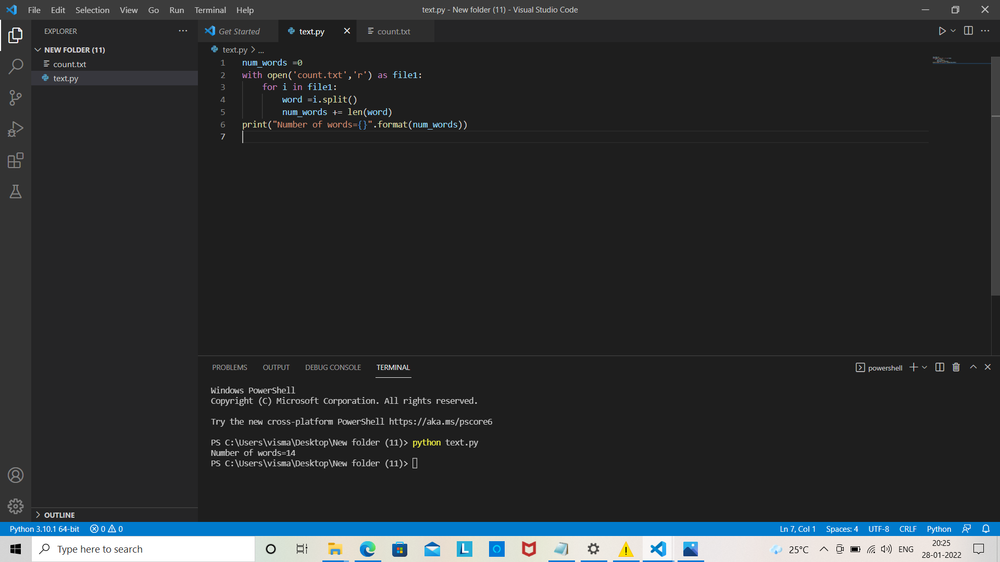
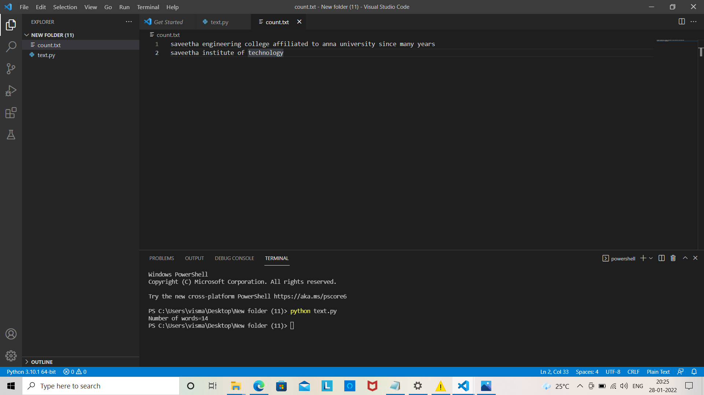

# Word-count
## AIM:
To write a python program for getting the word count from a text.
## EQUIPEMENT'S REQUIRED: 
PC
Anaconda - Python 3.7
## ALGORITHM: 

Step 1:
Create a new text file

Step 2:
Open the file using open() in read mode

Step 3:
Open the file using open() in read mode

Step 4:
for each line split the words and store in a list

Step 5:
add the length of the list to the count for each line

Step 6:
print the count

## PROGRAM:
num_words =0
with open('text.txt','r') as file1:
    for i in file1:
        word =i.split()
        num_words += len(word)
print("Number of words={}".format(num_words))

### OUTPUT:

## RESULT:
Thus the program is written to find the word count from a text.
